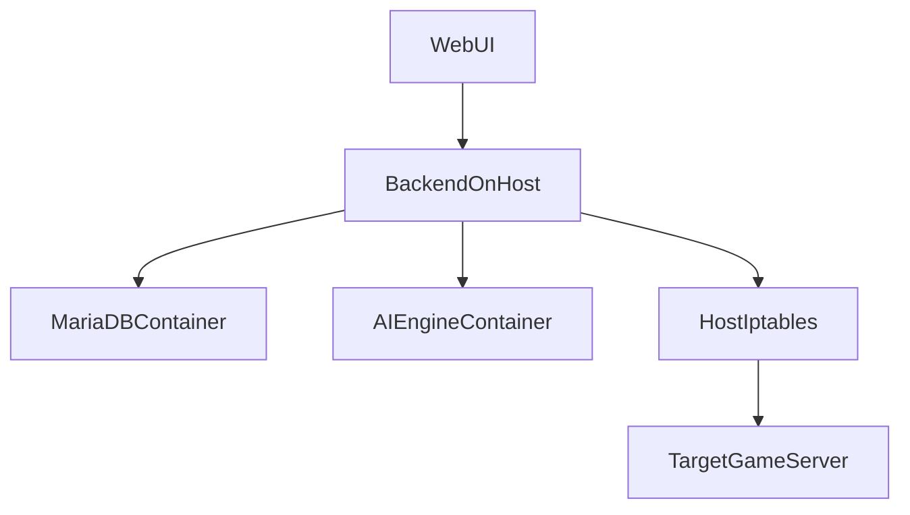

# Plan chuyển backend ra host và sửa logic NAT

## Mục tiêu
- Bỏ container `backend`, chỉ giữ lại 2 container: `db` và `ai_engine`.
- Cho backend Node.js chạy trực tiếp trên server chính để thao tác `iptables`/`iptables-save` đúng ngữ cảnh host.
- Cập nhật tài liệu triển khai để phản ánh kiến trúc mới.
- Sửa bug logic kiểm tra tồn tại rule trong NAT service.

## Hiện trạng cần thay đổi
- `Dockerfile` và `docker-entrypoint.sh` hiện chỉ phục vụ container backend, không còn cần thiết khi backend chạy host: [Dockerfile](G:/Test_antiddos/NRO_PROTECTED/firewall/Dockerfile), [docker-entrypoint.sh](G:/Test_antiddos/NRO_PROTECTED/firewall/docker-entrypoint.sh).
- `docker-compose.yml` hiện vẫn khai báo service `backend` và dùng hostname nội bộ Docker như `db` và `ai_engine`: [docker-compose.yml](G:/Test_antiddos/NRO_PROTECTED/firewall/docker-compose.yml).
- `backend/server.js` nạp `.env` từ root repo và đọc web static trực tiếp từ thư mục `web/`, nên phù hợp để chạy host sau khi chuẩn hóa biến môi trường/kịch bản chạy: [backend/server.js](G:/Test_antiddos/NRO_PROTECTED/firewall/backend/server.js).
- `backend/config/config.js` đã có fallback host-friendly (`127.0.0.1`) cho DB và AI, nhưng hiện Compose vẫn override sang hostname Docker: [backend/config/config.js](G:/Test_antiddos/NRO_PROTECTED/firewall/backend/config/config.js).
- `backend/services/nat.service.js` đang kiểm tra rule bằng `stdout` của `iptables -C`, đây là sai vì `iptables -C` báo kết quả qua exit code: [backend/services/nat.service.js](G:/Test_antiddos/NRO_PROTECTED/firewall/backend/services/nat.service.js).
- `SETUP.md` đang hướng người dùng build cả stack Docker và chạy migrate qua `docker compose exec backend`, cần đổi toàn bộ luồng cài đặt/deploy theo host backend: [SETUP.md](G:/Test_antiddos/NRO_PROTECTED/firewall/SETUP.md).

## Hướng chỉnh sửa

### 1. Thu gọn Compose còn 2 service
- Xóa service `backend` khỏi [docker-compose.yml](G:/Test_antiddos/NRO_PROTECTED/firewall/docker-compose.yml).
- Với `db` và `ai_engine`, expose port ra host an toàn, ưu tiên bind `127.0.0.1` nếu backend cùng máy:
  - DB: `127.0.0.1:3306:3306` hoặc port khác nếu host đã có MariaDB.
  - AI: `127.0.0.1:8000:8000`.
- Giữ volume/log mount hiện có cho `ai_engine` vì backend host vẫn đọc `/var/log/nroshield`.

### 2. Chuẩn hóa cấu hình backend chạy host
- Dùng `.env` root repo cho backend host vì [backend/server.js](G:/Test_antiddos/NRO_PROTECTED/firewall/backend/server.js) đã nạp `../.env`.
- Chỉnh tài liệu và ví dụ env để backend host dùng:
  - `DB_HOST=127.0.0.1`
  - `DB_PORT=<port đã publish>`
  - `AI_BASE_URL=http://127.0.0.1:8000`
  - không phụ thuộc `DB_HOST=db` hay `AI_ENGINE_HOST=ai_engine`.
- Bổ sung cách chạy backend bằng `npm install`, `npm run migrate`, rồi chạy process manager như `systemd` hoặc `pm2`.

### 3. Sửa bug logic NAT/iptables
- Trong [backend/services/nat.service.js](G:/Test_antiddos/NRO_PROTECTED/firewall/backend/services/nat.service.js), thay cơ chế:
  - từ: dựa vào `stdout` của `iptables -C`
  - sang: bắt exit code thành công/thất bại để xác định rule tồn tại.
- Khi add rule:
  - chỉ `-I` nếu `iptables -C` báo chưa tồn tại.
  - giữ validate input hiện có.
- Khi remove rule:
  - tiếp tục xóa idempotent, nhưng có thể cân nhắc helper dùng chung để giảm lặp logic add/remove/check.
- Giữ `iptables-save` sau thay đổi để đồng bộ persistence trên host.

### 4. Cập nhật tài liệu cài đặt và vận hành
- Viết lại phần backend trong [SETUP.md](G:/Test_antiddos/NRO_PROTECTED/firewall/SETUP.md):
  - backend không còn trong Docker.
  - chỉ `docker compose up -d db ai_engine`.
  - migrate chạy bằng Node trên host, không dùng `docker compose exec backend ...`.
- Thêm hướng dẫn vận hành backend host:
  - cài Node.js 18
  - `cd backend && npm install`
  - chạy migrations
  - tạo `systemd service`
  - xem log backend bằng `journalctl`
- Loại hoặc chỉnh các đoạn nhắc đến image/container backend để tránh người dùng deploy sai.

## Rủi ro và lưu ý
- Nếu host đã có MariaDB/port 3306 bận, cần chọn port publish khác và đồng bộ vào `.env`.
- Backend host cần đủ quyền chạy `iptables`; nếu không chạy bằng root thì phải có `sudoers`/wrapper rõ ràng.
- Nếu tiếp tục giữ `Dockerfile` cho mục đích cũ hoặc rollback, cần ghi rõ là không còn là luồng deploy chính để tránh nhầm.

## Sơ đồ kiến trúc sau khi đổi

## Kết quả mong muốn
- Proxy create/toggle/delete không còn fail vì thiếu `iptables` trong container.
- NAT rule được áp trực tiếp lên host nơi traffic đi qua.
- Hướng dẫn cài đặt phản ánh đúng kiến trúc thực tế: backend host, Docker chỉ còn `db` và `ai_engine`.