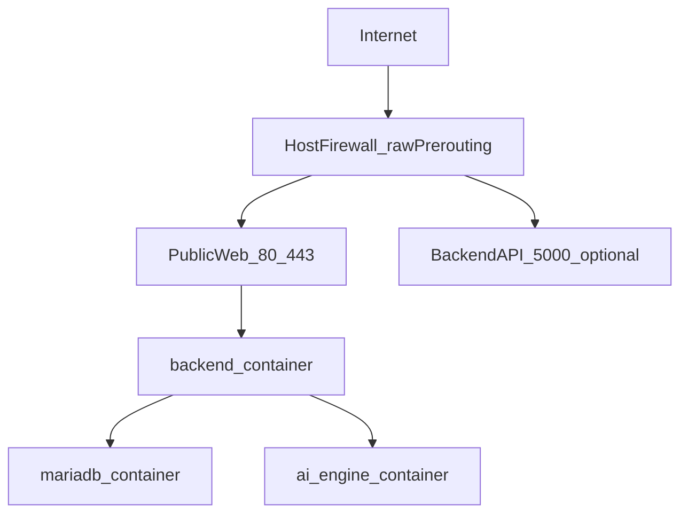

# Đề xuất triển khai 3 container tách riêng, public web quản trị

## Kiến trúc khuyến nghị
- Giữ toàn bộ anti-DDoS thật trên host: các script trong [firewall/master_setup.sh](firewall/master_setup.sh) và các rule `raw PREROUTING`, `mangle`, `filter`, `ipset`, `sysctl`.
- Chạy 3 container riêng bằng một file Compose:
  - `mariadb`: chỉ dùng nội bộ, không public internet.
  - `backend`: API + WebSocket trên cổng `5000`, có thể chỉ bind nội bộ hoặc public nếu dashboard gọi trực tiếp.
  - `ai_engine`: chỉ dùng nội bộ, không public internet.
- Public phần web quản trị bằng web server tĩnh/reverse proxy ở phía trước. Dashboard web hiện là static app trong [web/index.html](web/index.html) và logic JS trong [web/app.js](web/app.js), còn WebSocket hiện kết nối về `/ws` trên backend theo tài liệu ở [README.md](README.md).

## Mô hình traffic nên dùng

## Khuyến nghị public web quản trị
- Tốt nhất là public web dashboard qua `80/443` bằng reverse proxy/web server ở lớp public.
- Dashboard nên gọi API backend và WebSocket qua domain/cùng origin để tránh cấu hình CORS/WebSocket rối.
- Nếu cần tối giản trước mắt, có thể public trực tiếp backend `:5000` và serve static dashboard từ ngoài, nhưng đây không phải cấu hình đẹp nhất cho production.

## Vì sao nên tách 3 container thay vì gộp 1
- Phù hợp mô tả service hiện có trong [README.md](README.md):
  - `backend` cổng `5000`
  - `mariadb` cổng `3306`
  - `ai_engine` cổng `8000`
- Dễ restart, update, log, backup và scale từng phần.
- `mariadb` cần volume riêng và lifecycle riêng.
- `ai_engine` có dependency Python và runtime riêng, không nên buộc chung với Node backend.
- Không ảnh hưởng cơ chế DROP vì packet vẫn bị chặn ở host trước khi vào Docker networking.

## Các điểm cấu hình cần chốt
- Biến môi trường theo [README.md](README.md): `DB_HOST`, `DB_PORT`, `DB_USER`, `DB_NAME`, `API_PORT`, `AI_ENGINE_PORT`.
- Với mô hình 3 container:
  - `DB_HOST=db` hoặc `mariadb`
  - backend gọi AI bằng hostname nội bộ của Compose
- Chỉ mở public các cổng thật sự cần:
  - `80/443` cho web quản trị
  - `5000` chỉ mở nếu cần truy cập API trực tiếp từ ngoài
  - không public `3306` và `8000`

## Đề xuất triển khai thực tế
- Host:
  - cài Docker/Compose
  - chạy firewall scripts trước
  - whitelist các cổng quản trị/web/API cần thiết trong firewall host
- Docker:
  - 1 network riêng cho các container ứng dụng
  - 1 volume persistent cho MariaDB
  - backend depends on db và ai_engine
- Web quản trị:
  - dùng static web hiện có ở [web/index.html](web/index.html) và [web/app.js](web/app.js)
  - đặt sau reverse proxy để route:
    - `/` -> dashboard static
    - `/api` -> backend
    - `/ws` -> backend WebSocket

## Tài liệu/code hiện có hỗ trợ đề xuất này
- README đã mô tả kiến trúc tách lớp backend/db/AI và firewall host:
  - [README.md](README.md)
- Docker section hiện đã mô tả đúng 3 service logic:
  - `backend`, `mariadb`, `ai_engine` trong [README.md](README.md)
- Firewall setup dùng systemd/host-level restore ở [firewall/master_setup.sh](firewall/master_setup.sh), phù hợp với việc không containerize lớp anti-DDoS.

## Nếu triển khai tiếp ở bước code
- Cập nhật tài liệu triển khai để phản ánh mô hình production: 3 container + web public + anti-DDoS host.
- Rà lại dashboard web để bảo đảm endpoint API/WebSocket dùng domain/path phù hợp reverse proxy.
- Soạn `docker-compose.yml` theo nguyên tắc:
  - `db` internal only
  - `ai_engine` internal only
  - `backend` exposed theo nhu cầu
  - web public qua reverse proxy/static server.
