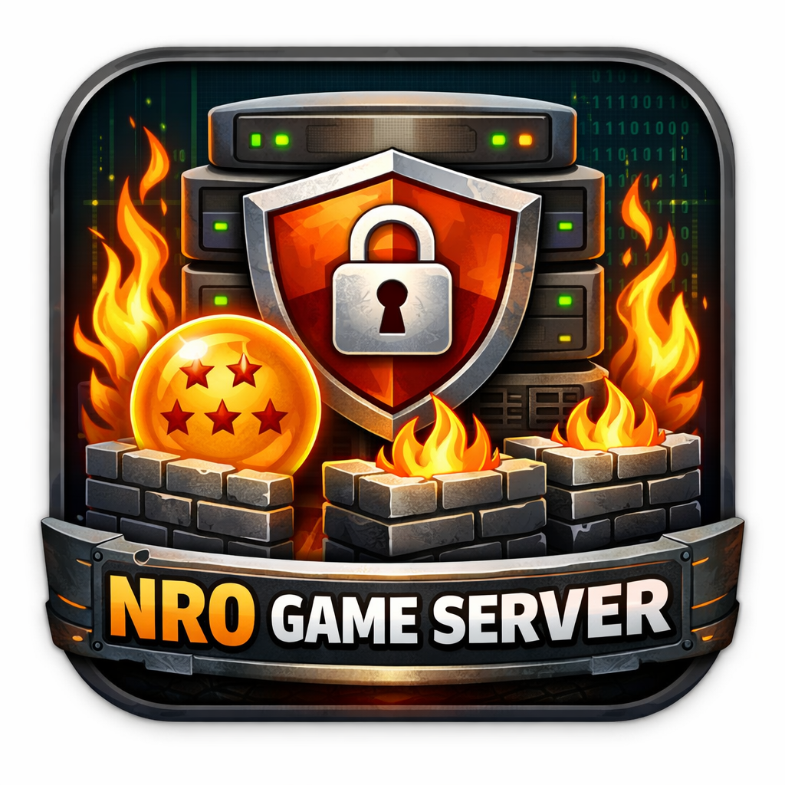

<div align="center">
  
  <h1>NRO Shield v2.2</h1>
  <p><strong>He thong Chong DDoS Da Tang cho Game Server & Web Server</strong></p>
  <p>AI-Powered | Multi-Game | Real-time | Flutter App</p>

  [](https://opensource.org/licenses/MIT)
  [](https://nodejs.org/)
  [](https://www.python.org/)
  [](https://www.docker.com/)
  [](https://github.com/hoangtuvungcao/firewall/actions)
</div>

---

## Muc Luc

- [Gioi thieu](#gioi-thieu)
- [Tinh nang](#tinh-nang)
- [Kien truc he thong](#kien-truc-he-thong)
- [Cau truc thu muc](#cau-truc-thu-muc)
- [Yeu cau he thong](#yeu-cau-he-thong)
- [Cai dat nhanh](#cai-dat-nhanh)
- [Cai dat chi tiet](#cai-dat-chi-tiet)
- [Cau hinh](#cau-hinh)
- [He thong Firewall](#he-thong-firewall)
- [Backend API](#backend-api)
- [Flutter App](#flutter-app)
- [AI Engine](#ai-engine)
- [Docker](#docker)
- [Game duoc ho tro](#game-duoc-ho-tro)
- [Xu ly su co](#xu-ly-su-co)
- [Dong gop](#dong-gop)

---

## Gioi thieu

NRO Shield la he thong phong chong tan cong DDoS toan dien, duoc thiet ke chuyen biet cho game server va web server. He thong ket hop:

- **Kernel-level packet filtering** -- Drop tan cong tai tang `raw` table (truoc conntrack), khong ton CPU/RAM
- **AI anomaly detection** -- Machine Learning phat hien tan cong zero-day
- **Multi-game profiles** -- Toi uu cho 9+ loai game server khac nhau
- **Real-time monitoring** -- WebSocket dong bo giua firewall, backend, va app
- **Mobile management** -- Flutter app quan ly tu xa tren dien thoai

### Van de giai quyet

Khi VPS bi tan cong DDoS (botnet), cac giai phap thong thuong xu ly packet o tang ung dung -- **ton CPU, RAM, va gay nghen conntrack**. NRO Shield giai quyet bang cach:

```
Packet tan cong --> raw PREROUTING (DROP ngay) --> KHONG tao conntrack --> KHONG ton tai nguyen
                    ^^^^^^^^^^^^^^^^^^^^^^^^
                    Xu ly tai day = zero resource usage
```

---

## Tinh nang

### Chong tan cong (20+ scripts)

| Tinh nang | Mo ta |
|-----------|--------|
| Early Drop Engine | Drop tai `raw` table truoc conntrack -- zero CPU/RAM |
| Anti-SYN Flood | 3 lop: global rate, per-IP, per-IP-per-port |
| Anti-UDP Flood | Game-aware filtering voi packet size validation |
| Anti-Bypass | TCP validation (MSS, TTL, flags), UDP pattern detection |
| Anti-Carpet Bombing | Gioi han connections per destination port |
| Anti-Amplification | Block 14+ reflection source ports |
| Anti-Botnet | Tu dong sync IP blacklist tu 5 threat intelligence sources |
| Challenge-Response | TCP SYN Cookie + UDP challenge tokens |
| Fingerprinting | Nhan dien bot qua TCP window, TTL, connection rate |
| Dynamic Blacklist | Auto-ban IP vuot nguong (kiem tra moi 10 giay) |
| Adaptive Rate Limit | Tu dieu chinh nguong theo muc conntrack usage |
| Backup/Restore | Sao luu va phuc hoi toan bo iptables/ipset/sysctl |

### Quan ly va Giam sat

| Tinh nang | Mo ta |
|-----------|--------|
| 2FA Authentication | TOTP (Google Authenticator) + backup codes |
| Phan quyen 4 cap | admin / reseller / premium / basic |
| Server Health | Auto ping/port check moi 5 phut |
| Attack Analytics | Phan tich xu huong, top attackers, timeline |
| Webhook Alerts | Thong bao qua Discord/Slack khi co su kien |
| Alert Rules | Canh bao tuy chinh (nguong PPS, Mbps, connections) |
| Audit Log | Ghi lai moi hanh dong admin |
| Config Backup | Sao luu/phuc hoi cau hinh firewall |

### Ha tang

| Tinh nang | Mo ta |
|-----------|--------|
| Docker | Dockerfile + docker-compose cho trien khai nhanh |
| CI/CD | GitHub Actions (4 jobs: lint, syntax, security, docker) |
| Systemd | Auto-restore firewall khi reboot |
| Log Rotate | Tu dong xoay log, giu 30 ngay |

---

## Kien truc he thong

```
                     +------------------+
                     |   Flutter App    |
                     |   (iOS/Android)  |
                     +--------+---------+
                              | REST + WebSocket
                     +--------v---------+
                     |  Web Dashboard   |
                     |  (Browser)       |
                     +--------+---------+
                              |
           +------------------v------------------+
           |        Backend API (Node.js)        |
           |            Port 5000                |
           +------------+----------+-------------+
           | Auth/2FA   | WebSocket | Cron Jobs  |
           | CRUD APIs  | Real-time | Health Mon |
           | Analytics  | Sync      | Blocklist  |
           +-----+------+-----+----+-------------+
                 |            |
      +----------v---+ +-----v----------+
      |   MariaDB    | |   AI Engine    |
      |   Database   | |   (Python)     |
      |   25 tables  | |   Port 8000    |
      +--------------+ +----------------+
                 |
      +----------v-----------------------+
      |      Firewall Scripts (20+)      |
      |      iptables / ipset / raw      |
      +----------------------------------+
      | raw PREROUTING --> Early Drop    |  <-- Zero resource
      | mangle PREROUTING --> Validate   |  <-- Minimal CPU
      | filter INPUT --> Game rules      |  <-- Only clean packets
      +----------------------------------+
```

### Thu tu xu ly packet

```
1. raw PREROUTING     --> Blacklist, invalid flags, bogon IPs, amplification
                          (DROP o day = KHONG ton CPU/RAM/conntrack)
2. conntrack          --> Chi xu ly packets hop le
3. mangle PREROUTING  --> TTL, MSS, PPS rate limit
4. filter INPUT       --> Game-specific rules, connection limits
```

---

## Cau truc thu muc

```
nroshield/
|-- backend/                    # Node.js API Server
|   |-- config/                 # Database & app config
|   |-- database/               # Migrations (v1, v2, v3) + seed
|   |-- middleware/              # Auth, role check, audit log
|   |-- routes/                 # 17 route files
|   |-- services/               # Business logic (TOTP, health, webhook...)
|   |-- server.js               # Entry point
|   +-- package.json
|
|-- firewall/                   # Bash scripts (20 scripts)
|   |-- early_drop.sh           # Raw table pre-conntrack (v2.2)
|   |-- master_setup.sh         # One-command setup (9 steps)
|   |-- iptables_base.sh        # Base rules + ipset
|   |-- anti_ddos_v2.sh         # Multi-layer DDoS protection
|   |-- anti_bypass.sh          # TCP/UDP bypass prevention
|   |-- anti_botnet.sh          # Botnet IP blocking
|   |-- multi_game_support.sh   # 9 game profiles
|   |-- blocklist_sync.sh       # Threat intelligence sync
|   |-- challenge_response.sh   # Connection verification
|   |-- fingerprint.sh          # Bot detection
|   |-- backup_restore.sh       # Config backup/restore
|   |-- sysctl_hardening.sh     # Kernel optimization
|   |-- traffic_monitor.sh      # Traffic metrics
|   |-- install.sh              # Dependencies
|   |-- clean_rules.sh          # Reset all rules
|   |-- crowdsec_setup.sh       # CrowdSec integration
|   |-- fail2ban_setup.sh       # Fail2Ban setup
|   +-- samp_local_firewall.sh  # SA:MP local rules
|
|-- flutter_app/                # Flutter Mobile App
|   +-- lib/
|       |-- main.dart           # Entry + ThemeService
|       |-- screens/            # 12 screens
|       |-- services/           # API, auth, WebSocket, theme
|       +-- widgets/            # Custom widgets (ShieldLogo)
|
|-- web/                        # Web Dashboard (HTML/CSS/JS)
|   |-- index.html              # SPA entry
|   |-- css/                    # Styles
|   +-- js/                     # Chart.js, WebSocket, API calls
|
|-- ai_engine/                  # Python AI Engine
|   |-- main.py                 # FastAPI entry
|   |-- detector.py             # Isolation Forest model
|   |-- collector.py            # Traffic data collector
|   +-- requirements.txt
|
|-- telegram_bot/               # Telegram Bot
|   |-- bot.js                  # Bot (grammy)
|   +-- package.json
|
|-- Dockerfile                  # Docker image
|-- docker-compose.yml          # Multi-service deployment
|-- .github/workflows/ci.yml    # GitHub Actions CI/CD
|-- .env.example                # Environment template
|-- SETUP.md                    # Detailed setup guide
+-- README.md                   # This file
```

---

## Yeu cau he thong

| Thanh phan | Yeu cau toi thieu |
|------------|-------------------|
| OS | Ubuntu 20.04 / 22.04 LTS |
| CPU | 2 cores |
| RAM | 2 GB |
| Disk | 20 GB |
| Node.js | v18+ |
| Python | 3.9+ |
| MariaDB/MySQL | 10.6+ / 8.0+ |
| Root access | Bat buoc (cho iptables) |

---

## Cai dat nhanh

### Cach 1: Master Setup (khuyen nghi)

```bash
# 1. Clone repository
git clone https://github.com/hoangtuvungcao/firewall.git /opt/nroshield
cd /opt/nroshield

# 2. Cau hinh
cp .env.example .env
nano .env    # Sua: VPS_PUBLIC_IP, DB_PASS, JWT_SECRET

# 3. Cai dat dependencies
apt-get update && apt-get install -y mariadb-server nodejs npm iptables ipset
cd backend && npm install && cd ..

# 4. Khoi tao database
mysql -e "CREATE DATABASE nroshield CHARACTER SET utf8mb4;"
mysql -e "CREATE USER 'nroshield'@'localhost' IDENTIFIED BY 'YOUR_PASSWORD';"
mysql -e "GRANT ALL ON nroshield.* TO 'nroshield'@'localhost'; FLUSH PRIVILEGES;"
cd backend && node database/migrate.js && node database/migrate_v2.js && node database/migrate_v3.js && cd ..

# 5. Setup firewall (1 lenh duy nhat)
cd firewall && chmod +x *.sh && sudo bash master_setup.sh all

# 6. Khoi dong backend
cd ../backend && node server.js
```

### Cach 2: Docker

```bash
git clone https://github.com/hoangtuvungcao/firewall.git /opt/nroshield
cd /opt/nroshield
cp .env.example .env
nano .env
docker compose up -d
```

### Cach 3: Huong dan chi tiet tung buoc

Xem **[SETUP.md](SETUP.md)** -- huong dan cam tay chi viec tu VPS trong den hoat dong 100%.

---

## Cai dat chi tiet

### 1. Chuan bi he thong

```bash
export DEBIAN_FRONTEND=noninteractive
apt-get update -y && apt-get upgrade -y
apt-get install -y curl wget git nano build-essential \
  python3 python3-pip python3-venv \
  mariadb-server mariadb-client \
  iptables ipset iptables-persistent netfilter-persistent conntrack \
  net-tools iproute2 htop jq bc fail2ban
```

### 2. Cai Node.js 18

```bash
curl -fsSL https://deb.nodesource.com/setup_18.x | bash -
apt-get install -y nodejs
```

### 3. Cau hinh Database

```bash
systemctl enable --now mariadb

mysql -u root << 'SQL'
CREATE DATABASE IF NOT EXISTS nroshield CHARACTER SET utf8mb4 COLLATE utf8mb4_unicode_ci;
CREATE USER IF NOT EXISTS 'nroshield'@'localhost' IDENTIFIED BY 'MatKhauManh123!';
GRANT ALL PRIVILEGES ON nroshield.* TO 'nroshield'@'localhost';
FLUSH PRIVILEGES;
SQL
```

### 4. Clone va Cau hinh

```bash
git clone https://github.com/hoangtuvungcao/firewall.git /opt/nroshield
cd /opt/nroshield
cp .env.example .env
nano .env   # Sua cac gia tri theo VPS cua ban
```

### 5. Cai dat va Chay migrations

```bash
cd /opt/nroshield/backend
npm install
node database/migrate.js
node database/migrate_v2.js
node database/migrate_v3.js
```

### 6. Thiet lap Firewall

```bash
cd /opt/nroshield/firewall
chmod +x *.sh
sudo bash master_setup.sh all   # Hoac: nro, minecraft, samp, fivem...
```

**Master setup se thuc hien 9 buoc tu dong:**
1. Backup cau hinh hien tai
2. Cai dat dependencies
3. Kernel hardening (sysctl)
4. **Early Drop Engine** (raw/mangle pre-conntrack)
5. Base firewall rules
6. Anti-DDoS v2 + Anti-Bypass + Anti-Botnet
7. Game-specific rules
8. Systemd services (auto-restore on reboot)
9. Kiem tra va tong ket

### 7. Khoi dong Services

```bash
# Backend API
cd /opt/nroshield/backend && node server.js

# AI Engine
cd /opt/nroshield/ai_engine
python3 -m venv venv && source venv/bin/activate
pip install -r requirements.txt
python3 main.py

# Telegram Bot (tuy chon)
cd /opt/nroshield/telegram_bot && npm install && node bot.js
```

---

## Cau hinh

### File `.env`

| Bien | Bat buoc | Mac dinh | Mo ta |
|------|----------|----------|--------|
| `VPS_PUBLIC_IP` | Co | -- | IP cong khai VPS |
| `DB_PASS` | Co | -- | Mat khau MariaDB |
| `JWT_SECRET` | Co | -- | Secret key cho JWT token |
| `DB_HOST` | Khong | `127.0.0.1` | Database host |
| `DB_PORT` | Khong | `3306` | Database port |
| `DB_USER` | Khong | `nroshield` | Database user |
| `DB_NAME` | Khong | `nroshield` | Database name |
| `API_PORT` | Khong | `5000` | Backend API port |
| `AI_ENGINE_PORT` | Khong | `8000` | AI Engine port |
| `SSH_PORT` | Khong | `22` | SSH port |
| `PROXY_PORT_RANGE_START` | Khong | `30000` | Proxy port range start |
| `PROXY_PORT_RANGE_END` | Khong | `60000` | Proxy port range end |
| `MAX_CONN_PER_IP` | Khong | `500` | Max connections per IP |
| `SYN_RATE_LIMIT` | Khong | `300/sec` | SYN rate limit |
| `UDP_RATE_LIMIT` | Khong | `2000/sec` | UDP rate limit |
| `TELEGRAM_BOT_TOKEN` | Khong | -- | Telegram bot token |
| `TELEGRAM_CHAT_ID` | Khong | -- | Telegram chat ID |
| `AI_BLOCK_THRESHOLD` | Khong | `0.8` | AI auto-block threshold |

---

## He thong Firewall

### Early Drop Engine (Tinh nang chinh v2.2)

Script `early_drop.sh` xu ly packet tai `raw` table -- **truoc conntrack**. Dieu nay co nghia:

- Packet bi DROP **khong tao conntrack entry** -- khong ton RAM
- Packet bi DROP **khong qua connection tracking** -- khong ton CPU
- Chi co bandwidth mang bi anh huong (khong the tranh o tang VPS)

```
Botnet 100K PPS --> raw PREROUTING: DROP (blacklist match)
                --> Conntrack: 0 entries created
                --> CPU: ~0% usage increase
                --> RAM: 0 bytes allocated
```

**So sanh voi filter table (cach thong thuong):**
```
Botnet 100K PPS --> conntrack: 100K entries created (ton ~200MB RAM)
                --> filter INPUT: DROP (qua muon, tai nguyen da bi tieu hao)
                --> CPU: 30-50% xu ly conntrack
```

### Cac lop bao ve trong Early Drop

| Lop | Bang | Chain | Mo ta |
|-----|------|-------|--------|
| 1 | raw | PREROUTING | Blacklist ipset (4 sets), invalid TCP flags, bogon IPs |
| 2 | raw | PREROUTING | UDP amplification source ports, IP fragments |
| 3 | mangle | PREROUTING | TTL validation, MSS check, PPS rate limit |
| 4 | filter | INPUT | Game-specific rules (chi clean packets) |

### Danh sach Scripts

| Script | Chuc nang | Chay tai |
|--------|-----------|----------|
| `early_drop.sh` | Blacklist, invalid flags, bogon, amplification | raw PREROUTING |
| `iptables_base.sh` | Ipset, default policy, SSH, NAT | filter + mangle |
| `anti_ddos_v2.sh` | SYN/UDP/ACK/RST/FIN flood, amplification | filter INPUT |
| `anti_bypass.sh` | TCP/UDP validation, carpet bombing, HTTP flood | filter + mangle |
| `anti_botnet.sh` | Botnet IP blocking | filter INPUT |
| `multi_game_support.sh` | Game-specific packet validation | filter FORWARD |
| `blocklist_sync.sh` | Threat intelligence sync (5 sources) | ipset |
| `challenge_response.sh` | TCP SYN cookie, UDP challenge | filter |
| `fingerprint.sh` | Bot detection (TTL, window, rate) | filter |
| `backup_restore.sh` | Backup/restore iptables, ipset, sysctl | -- |
| `sysctl_hardening.sh` | Kernel TCP/IP optimization | sysctl |
| `master_setup.sh` | One-command setup (9 steps) | All |

### Auto-Blacklist (Systemd Timer)

Moi 10 giay, systemd timer kiem tra conntrack va tu dong them IP co >500 connections vao raw blacklist:

```
IP co 1000 connections --> auto them vao nroshield-rawdrop (timeout 1h)
--> Moi packet tiep theo bi DROP tai raw table
--> Conntrack entries cu timeout tu dong
--> Tai nguyen server giai phong dan
```

### Kernel Tuning

`early_drop.sh` tu dong toi uu kernel:

```
net.netfilter.nf_conntrack_max = 2000000    # Tang conntrack slots
net.core.netdev_max_backlog = 65536         # Tang network queue
net.ipv4.tcp_max_syn_backlog = 65536        # Tang SYN queue
net.ipv4.tcp_syncookies = 1                 # Bat SYN cookies
net.ipv4.tcp_fin_timeout = 15               # Giam FIN timeout
net.ipv4.tcp_tw_reuse = 1                   # Reuse TIME_WAIT
net.ipv4.conf.all.rp_filter = 1             # Reverse path filter
```

---

## Backend API

### Endpoints (17 route modules, 40+ endpoints)

| Module | Prefix | Endpoints chinh |
|--------|--------|-----------|
| Auth | `/api/auth` | register, login, profile |
| 2FA | `/api/2fa` | setup, verify, disable, status |
| Servers | `/api/servers` | CRUD, status |
| Proxy | `/api/proxy` | CRUD, toggle |
| Firewall | `/api/firewall` | rules, sync, geo-block |
| Admin | `/api/admin` | users, audit, broadcast |
| Health | `/api/health` | check, history, summary |
| Analytics | `/api/analytics` | overview, timeline, countries |
| Webhooks | `/api/webhooks` | CRUD, test |
| Backup | `/api/backups` | create, restore, delete |
| Alert Rules | `/api/alert-rules` | CRUD, toggle |
| Plans | `/api/plans` | list, details |
| Games | `/api/games` | list, profiles |
| Notifications | `/api/notifications` | list, read, count |
| Stats | `/api/stats` | system, traffic |
| AI | `/api/ai` | status, detections |
| Keys | `/api/keys` | validate, create |

### Phan quyen

| Role | Quyen |
|------|-------|
| `admin` | Toan quyen: quan ly users, servers, firewall, audit |
| `reseller` | Quan ly khach hang, tao license key |
| `premium` | Nhieu server, tinh nang nang cao, AI protection |
| `basic` | 1 server, tinh nang co ban |

### WebSocket

```
ws://YOUR_IP:5000/ws

Events:
- TRAFFIC_METRICS  --> PPS, Mbps, connections (moi 5 giay)
- attack_alert     --> Khi phat hien tan cong
- rule_update      --> Khi firewall rule thay doi
- sync_complete    --> Khi dong bo rules hoan tat
```

### Cron Jobs tu dong

- **Moi 5 phut**: Server health check (ping + port)
- **Moi 6 gio**: Blocklist sync tu threat intelligence
- **Moi 10 giay**: Auto-blacklist IP tan cong (systemd timer)
- **Daily**: Rotate attack logs (giu 30 ngay)

---

## Flutter App

### Cai dat

```bash
cd flutter_app
flutter pub get
flutter run
```

### Cau hinh ket noi Backend

Sua `lib/services/api_service.dart`:
```dart
static const String baseUrl = 'http://YOUR_VPS_IP:5000';
```

### Man hinh

| Man hinh | Mo ta |
|----------|--------|
| Login | Dang nhap voi animations, grid background |
| Dashboard | Tong quan: stats, servers, traffic real-time |
| Servers | Quan ly server + game type selection |
| Attacks | Danh sach tan cong + severity |
| Firewall | Quan ly rules + sync status |
| Notifications | Thong bao read/unread |
| Health | Server health status (green/yellow/red) |
| Analytics | Bieu do tan cong (fl_chart) |
| Webhooks | Quan ly Discord/Slack webhooks |
| Backup | Sao luu/phuc hoi cau hinh |
| Settings | 2FA setup, theme toggle, language |
| Admin | 5 tab: Users, Servers, Audit, Plans, Games |

### Tinh nang

- **Dark/Light mode** voi ThemeService
- **Real-time** qua WebSocket (auto-reconnect)
- **2FA setup** voi QR code + backup codes
- **fl_chart** bieu do phan tich tan cong
- **Material 3** design system

---

## AI Engine

### Mo hinh

- **Isolation Forest** -- Phat hien anomaly dua tren 11 features
- Features: PPS, Mbps, SYN ratio, UDP ratio, connections, unique IPs, avg packet size...

### Luong xu ly

```
Traffic Monitor --> JSON metrics --> AI Engine phan tich
                                          |
                                  Anomaly Score (0-1)
                                          |
                          Score > 0.8 --> Auto-block IP
                          Score > 0.6 --> Rate-limit IP
                          Score < 0.6 --> Normal traffic
```

---

## Docker

### Docker Compose

```bash
cp .env.example .env
nano .env
docker compose up -d
```

Services:
- `backend` -- Node.js API (port 5000)
- `mariadb` -- Database (port 3306)
- `ai_engine` -- Python AI (port 8000)

### Dockerfile

```bash
docker build -t nroshield:latest .
docker run -d -p 5000:5000 --env-file .env nroshield:latest
```

---

## Game duoc ho tro

| Game | Giao thuc | Ports | Rate Limit | Packet Size |
|------|-----------|-------|------------|-------------|
| Ngoc Rong Online (NRO) | UDP | 14300-14400 | 30/s | 28-1500 |
| SA:MP | UDP | 7777-7778 | 100/s | 28-2048 |
| Minecraft | TCP | 25565 | 20/s | 1-32767 |
| FiveM (GTA V) | UDP+TCP | 30120 | 200/s | 28-4096 |
| MU Online | TCP | 44405 | 25/s | 4-4096 |
| Rust | UDP+TCP | 28015-28016 | 150/s | 28-4096 |
| ARK: Survival | UDP | 7777-7778, 27015 | 120/s | 28-4096 |
| Counter-Strike 2 | UDP | 27015-27016 | 200/s | 28-4096 |
| Lineage 2 | TCP | 2106, 7777 | 20/s | 4-8192 |
| Web Server | TCP | 80, 443 | 500/s | 1-65535 |

Them game moi: Sua `multi_game_support.sh` hoac them qua Admin API.

---

## Xu ly su co

### Backend khong ket noi duoc Database

```bash
systemctl status mariadb
# Neu khong chay:
systemctl start mariadb

# Kiem tra credentials:
mysql -u nroshield -p'YOUR_PASSWORD' -e "SHOW DATABASES;"
```

### Firewall rules bi mat sau reboot

```bash
# Kiem tra systemd service:
systemctl status nroshield-firewall

# Chay lai master setup:
cd /opt/nroshield/firewall && sudo bash master_setup.sh all
```

### WebSocket khong ket noi

Kiem tra WebSocket path phai la `/ws`:
```
ws://YOUR_IP:5000/ws
```

### Reset toan bo firewall

```bash
cd /opt/nroshield/firewall && sudo bash clean_rules.sh
# Sau do chay lai:
sudo bash master_setup.sh all
```

### Xem logs

```bash
# Backend
journalctl -u nroshield-api -f

# Firewall drops
tail -f /var/log/syslog | grep NROSHIELD

# Attack logs
ls /var/log/nroshield/attacks/

# Auto-blacklist
tail -f /var/log/nroshield/auto_rawdrop.log
```

---

## CI/CD

GitHub Actions chay 4 jobs khi push/PR:

| Job | Mo ta |
|-----|--------|
| Backend Lint | Require tat ca JS modules, kiem tra syntax |
| Firewall Syntax | `bash -n` tren tat ca scripts |
| Security Check | Quet hardcoded secrets, command injection |
| Docker Build | Build Docker image thanh cong |

---

## Dong gop

1. Fork repository
2. Tao branch: `git checkout -b feature/ten-tinh-nang`
3. Commit: `git commit -m "Add: mo ta"`
4. Push: `git push origin feature/ten-tinh-nang`
5. Tao Pull Request

---

## License

MIT License -- Xem [LICENSE](LICENSE) de biet chi tiet.

---

<div align="center">
  <p><strong>NRO Shield v2.2</strong> -- Bao ve game server cua ban khoi moi cuoc tan cong DDoS</p>
  <p>Made with love for the gaming community</p>
</div>
